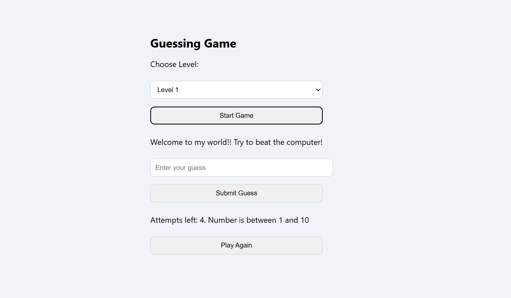

# 🎮 Guessing Game

A fun, interactive number guessing game built with **HTML, CSS, and JavaScript**. Players choose a difficulty level and try to guess a secret number within a limited number of attempts.

## 🚀 Features

- 🔢 Three challenging difficulty levels:
  - **Level 1**: 1–10 range (4 attempts)
  - **Level 2**: 1–20 range (6 attempts)
  - **Level 3**: 1–30 range (10 attempts)
- ✅ Real-time feedback based on your guess
- 🔁 "Play Again" feature for continuous gameplay
- 😎 Fun and motivating messages at every stage

## 📸 Preview



> You can add a screenshot of the game and name it `screenshot.png`, or remove this section if not needed.

## 🛠️ Built With

- **HTML5**
- **CSS3**
- **JavaScript**

## How to Play

1. Clone the repository:
   ```bash
   git clone https://github.com/bowale-os/rock-paper-scissors.git
   ```
2. Navigate to the project directory:
   ```bash
   cd rock-paper-scissors
   ```
3. Open the `index.html` file in your browser.
4. Choose a difficulty level and try to guess the secret number before your attempts run out.
5. Use the “Play Again” button to restart the game at any time.

## 📁 Project Structure

```
rock-paper-scissors/
├── index.html
├── README.md
└── screenshot.png
```

## 🌱 Future Improvements

- Add sound effects for guesses
- Animate feedback messages
- Implement dark mode
- Add a scoreboard or countdown timer

## 🙌 Author

**Daniel Sobowale**  
🎓 Freshman @ Fisk University | Aspiring Data Scientist & Full-Stack Dev  
📍 GitHub: [bowale-os](https://github.com/bowale-os)

---

> “You beat the matrix, nobody ever beats me!” 😏
```
